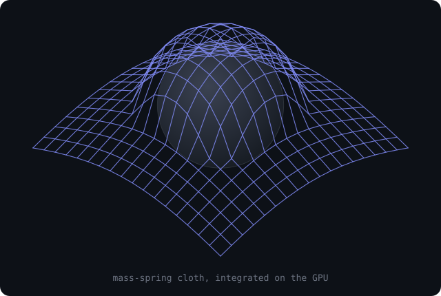

# GPU Cloth Simulation

<p align="center">
  
</p>


A real-time cloth simulation that runs its physics entirely on the GPU, written in Rust with [wgpu](https://wgpu.rs/) (WebGPU) and WGSL compute shaders. A square piece of cloth falls under gravity, collides with a sphere and the ground, and settles, with every spring force computed in parallel on the GPU.

Built for the parallel-programming course at ECAM (Brussels).

This is a **learning project**. I built it to get hands-on with two things at once: **parallel programming** (moving a physics solver onto thousands of GPU threads that all run at the same time, which forces you to design around data races, double-buffering and workgroups) and the **Rust** language (ownership, traits and zero-cost abstractions, plus the `wgpu`/WGSL ecosystem for talking to the GPU). The cloth is the excuse; the real goal was the GPU compute model and learning Rust.

## What it demonstrates

- A **mass-spring physical model** solved on the GPU rather than the CPU, so thousands of particles are integrated in parallel every frame.
- A real **GPU compute pipeline** (WGSL compute shader) feeding a separate **render pipeline**, the two communicating through GPU storage buffers.
- A **ping-pong buffer** scheme (read from `ping`, write to `pong`, then swap) to update particle state without read/write conflicts across parallel invocations.
- Interactive tuning of the physics in real time through an [egui](https://github.com/emilk/egui) panel.

## The physics model

Each cloth particle is a point mass linked to its neighbours by three families of springs (Hooke's law, with velocity damping to keep the system stable):

- **Structural** springs (horizontal and vertical neighbours) hold the grid together.
- **Shear** springs (diagonal neighbours) resist in-plane shearing.
- **Bend** springs (two cells apart) resist folding.

On top of the spring forces, the compute shader applies gravity, ground collision, collision against a sphere of configurable radius, friction, and a distance constraint that caps how far a spring can stretch (to avoid the cloth exploding at large time steps).

## Architecture

```
main.rs
  └── sets up the wgpu-bootstrap Runner (window, device/queue, egui, frame loop)
        └── InstanceApp (instances_app.rs)   the whole application
              ├── Compute pipeline  ── compute.wgsl   physics step (spring forces + integration)
              │     ├── instances_ping / instances_pong   particle state (position + velocity)
              │     ├── TimeUniform        time step / duration
              │     └── PhysicsParams      stiffness, damping, mass, rest length, sphere radius...
              │
              └── Render pipeline   ── shader.wgsl
                    ├── draws the cloth grid (instanced from the simulated positions)
